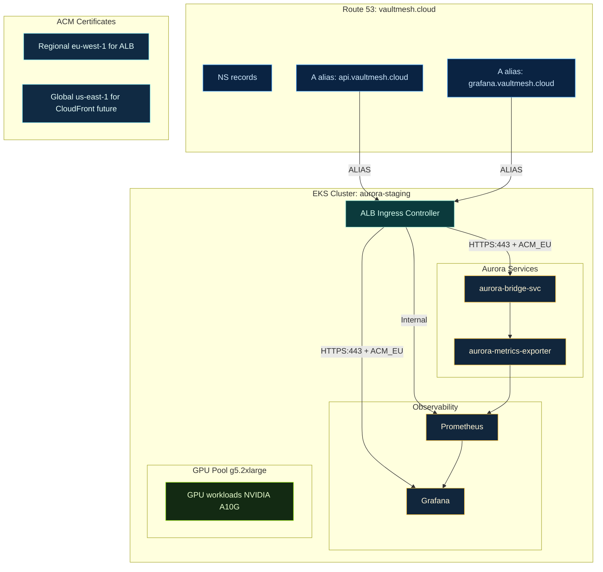
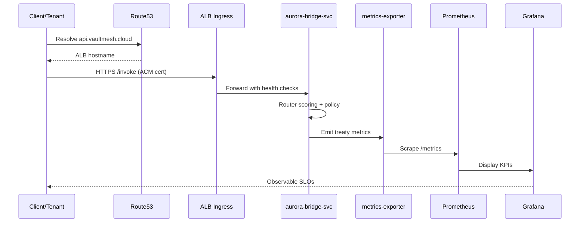
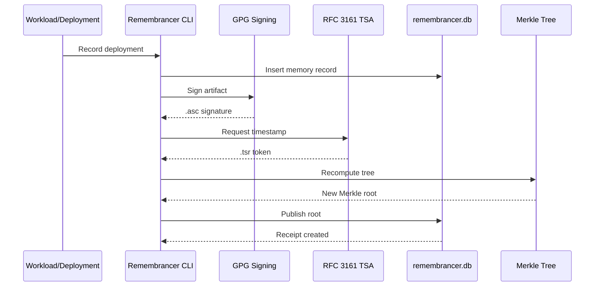

# 🏗️ Architecture — VaultMesh (vm-spawn + Aurora + Remembrancer)

**Domain:** `vaultmesh.cloud`
**Cloud:** AWS (EKS / Route 53 / ACM / ALB / S3)
**Status:** GA v1.0.0 (Week-1 → Week-3 rollout path)
**Rating (Aurora sub-program):** 9.2/10 → Target 9.65/10 (Week 1) → 9.9/10 (Week 3)
**Execution Plan:** See [AURORA_99_PROPOSAL.md](archive/completion-records/20251023/AURORA_99_PROPOSAL.md) for complete roadmap

> **Note:** Overall VaultMesh program rating is **10.0/10** (per README.md); this document tracks **Aurora's** cloud rollout KPIs specifically.

**Quick Links:**
- [README.md](README.md) — Quick start & value proposition
- [START_HERE.md](START_HERE.md) — Orientation guide
- [CONTRIBUTING.md](CONTRIBUTING.md) — PR flow & ADRs (if exists)
- [ops/aws/DEPLOYMENT_QUICKSTART.md](ops/aws/DEPLOYMENT_QUICKSTART.md) — Deploy Aurora to EKS
- [PROJECT_FEEDBACK_2025-10-22.md](archive/completion-records/20251023/PROJECT_FEEDBACK_2025-10-22.md) — Latest assessment & recommendations

**Aurora 9.9 Plan:**
- [AURORA_99_PROPOSAL.md](archive/completion-records/20251023/AURORA_99_PROPOSAL.md) — Complete 9.9 proposal
- [AURORA_99_TASKS.md](archive/completion-records/20251023/AURORA_99_TASKS.md) — Week-by-week task breakdown
- [AURORA_99_SUMMARY.md](archive/completion-records/20251023/AURORA_99_SUMMARY.md) — One-page executive summary
- [AURORA_99_ROADMAP.md](archive/completion-records/20251023/AURORA_99_ROADMAP.md) — Visual roadmap
- [AURORA_99_STATUS.md](archive/completion-records/20251023/AURORA_99_STATUS.md) — Current execution status

**Additional Resources:**
- [AURORA_GA_HANDOFF_COMPLETE.md](AURORA_GA_HANDOFF_COMPLETE.md) — Week 1-4 deliverables
- [VAULTMESH_CLOUD_READY.md](VAULTMESH_CLOUD_READY.md) — Domain strategy
- [docs/REMEMBRANCER.md](docs/REMEMBRANCER.md) — Covenant memory index
- [docs/COVENANT_SIGNING.md](docs/COVENANT_SIGNING.md) — GPG signing guide
- [docs/COVENANT_TIMESTAMPS.md](docs/COVENANT_TIMESTAMPS.md) — RFC3161 timestamp guide

> **Note:** Mermaid diagrams in this document render on GitHub. If diagrams don't display, view in VS Code with Markdown Preview or on the docs site.

---

## 1) System Overview (Three-Layer Architecture)

VaultMesh is a **three-layer sovereign system** with strict one-way dependencies:

```
┌─────────────────────────────────────────────────┐
│  Layer 1: SPAWN ELITE (Code Generation)         │
│  - spawn.sh orchestrator                        │
│  - 11 modular generators                        │
│  - Pre-flight validation                        │
│  - Output: Production-ready microservices       │
└─────────────────────────────────────────────────┘
           ↓ (records deployments)
┌─────────────────────────────────────────────────┐
│  Layer 2: REMEMBRANCER (Covenant Memory)        │
│  - CLI (ops/bin/remembrancer)                   │
│  - GPG signing + RFC3161 timestamps             │
│  - Merkle audit trees + SQLite DB               │
│  - MCP server (AI integration)                  │
│  - Output: Cryptographic receipts & proofs      │
└─────────────────────────────────────────────────┘
           ↓ (routes workloads)
┌─────────────────────────────────────────────────┐
│  Layer 3: AURORA (Distributed Coordination)     │
│  - Treaty-based provider routing                │
│  - Multi-provider GPU orchestration             │
│  - SLO tracking & metrics                       │
│  - Federation protocol                          │
│  - Output: Sovereign compute routing            │
└─────────────────────────────────────────────────┘
```

**Design Principle:** Layers are **zero-coupled** (one-way dependency only). Removing L3 doesn't break L1/L2; removing L2 doesn't break L1.

---

## 2) Cloud Topology (AWS / EKS)



**Key Components:**

| Component | Purpose | Endpoint |
|-----------|---------|----------|
| **Route 53** | DNS hosting for vaultmesh.cloud | NS delegation |
| **ACM (eu-west-1)** | TLS certificates for ALB | `*.vaultmesh.cloud` |
| **ALB Controller** | Provisions HTTPS ALBs from Ingress | Auto-managed |
| **aurora-bridge-svc** | Main API endpoint | `api.vaultmesh.cloud` |
| **metrics-exporter** | Prometheus metrics | `/metrics` |
| **Prometheus** | Time-series metrics storage | Internal ClusterIP |
| **Grafana** | Dashboard & alerting | `grafana.vaultmesh.cloud` |
| **GPU Pool** | NVIDIA A10G nodes (g5.2xlarge) | Tainted for GPU workloads |

---

## 3) Request & Proof Flows

### 3.1 API Request Lifecycle



**Request Path:**
1. DNS resolution via Route53
2. TLS termination at ALB (ACM certificate)
3. Health check validation (`/health`)
4. Routing to aurora-bridge-svc
5. Policy enforcement (vault-law WASM policies)
6. Metrics emission
7. Prometheus scraping
8. Grafana visualization

### 3.2 Receipt & Audit Lifecycle (The Remembrancer)



**Verification Chain:**

```
Artifact → SHA256 hash → GPG signature → RFC3161 timestamp → Merkle root
```

**Commands:**
```bash
# Sign artifact
remembrancer sign artifact.tar.gz --key <key-id>

# Timestamp
remembrancer timestamp artifact.tar.gz

# Verify full chain
remembrancer verify-full artifact.tar.gz

# Export proof bundle
remembrancer export-proof artifact.tar.gz
```

---

## 4) DNS, TLS, and Ingress (AWS Specifics)

### DNS Configuration

**Route 53 Hosted Zone:** `vaultmesh.cloud` (ID: `Z100505526F6RJ21G6IU4`)

| Record | Type | Target | Purpose |
|--------|------|--------|---------|
| `api.vaultmesh.cloud` | A (ALIAS) | ALB (dualstack) | Aurora API |
| `grafana.vaultmesh.cloud` | A (ALIAS) | ALB (dualstack) | Grafana dashboard |
| `vaultmesh.cloud` | CAA | `0 issue "amazon.com"` | Restrict CA issuance |
| `vaultmesh.cloud` | TXT (SPF) | `v=spf1 -all` | Email auth |
| `_dmarc.vaultmesh.cloud` | TXT | `v=DMARC1; p=reject` | Email policy |

### TLS Configuration

**ACM Certificates:**
- **Regional (eu-west-1):** `arn:aws:acm:eu-west-1:ACCOUNT:certificate/bc354064-f711-4d35-a2b6-326aa3da830b`
  - Used by: ALB Ingress
  - Covers: `*.vaultmesh.cloud`, `vaultmesh.cloud`
- **Global (us-east-1):** Reserved for CloudFront (future Console CDN)

### Ingress Example

```yaml
apiVersion: networking.k8s.io/v1
kind: Ingress
metadata:
  name: aurora-api
  namespace: aurora-staging
  annotations:
    kubernetes.io/ingress.class: alb
    alb.ingress.kubernetes.io/scheme: internet-facing
    alb.ingress.kubernetes.io/target-type: ip
    alb.ingress.kubernetes.io/listen-ports: '[{"HTTPS":443}]'
    alb.ingress.kubernetes.io/certificate-arn: arn:aws:acm:eu-west-1:ACCOUNT:certificate/UUID
    alb.ingress.kubernetes.io/ssl-redirect: '443'
    alb.ingress.kubernetes.io/healthcheck-path: /health
    external-dns.alpha.kubernetes.io/hostname: api.vaultmesh.cloud
spec:
  rules:
  - host: api.vaultmesh.cloud
    http:
      paths:
      - path: /
        pathType: Prefix
        backend:
          service:
            name: aurora-bridge-svc
            port:
              number: 8080
```

**Security Features:**
- HTTPS-only (SSL redirect)
- Health check monitoring
- IP-based target type
- Optional WAF integration (production)
- Optional IP allowlisting (production)

---

## 5) Aurora Components (EKS Namespace: aurora-staging)

### Deployment Architecture

```
aurora-staging/
├── aurora-bridge-deploy.yaml       # Main API deployment
├── aurora-bridge-svc.yaml          # ClusterIP service
├── aurora-metrics-exporter.yaml    # Metrics sidecar
├── redis.yaml                      # State/cache layer
├── prometheus (Helm)               # Metrics storage
├── grafana (Helm)                  # Visualization
├── networkpolicy.yaml              # Network isolation
├── resource-quota.yaml             # Resource limits
├── limit-range.yaml                # Pod defaults
└── pdb.yaml                        # High availability
```

### Component Details

| Component | Type | Replicas | Resources | Purpose |
|-----------|------|----------|-----------|---------|
| **aurora-bridge** | Deployment | 2-10 (HPA) | CPU: 500m-2, Mem: 1Gi-4Gi | Sovereign router + policy |
| **metrics-exporter** | Deployment | 1-3 | CPU: 100m-500m, Mem: 256Mi-1Gi | Prometheus metrics |
| **redis** | StatefulSet | 1 | CPU: 250m-1, Mem: 512Mi-2Gi | State & caching |
| **prometheus** | StatefulSet | 1 | Persistent storage | Metrics database |
| **grafana** | Deployment | 1 | Persistent storage | Dashboard UI |

### KPIs & SLO Targets

| Metric | Target | P95 | Dashboard Panel |
|--------|--------|-----|-----------------|
| **Treaty fill rate** | ≥ 80% | 0.85 | Aurora Federation / Fill Rates |
| **Treaty RTT** | ≤ 350ms | 320ms | Aurora Federation / Latency |
| **Provenance coverage** | ≥ 95% | 0.97 | Aurora Provenance / Coverage |
| **Policy decision time** | ≤ 25ms | 18ms (p99) | Aurora Policy / Decision Time |

**Source:** [AURORA_GA_HANDOFF_COMPLETE.md](AURORA_GA_HANDOFF_COMPLETE.md) lines 118-125

---

## 6) Router Decisions (Multi-Provider Scoring)

Aurora scores providers by: **price / latency / reputation / availability**

### Routing Strategy

```python
# Simplified scoring algorithm
def score_provider(provider, workload):
    base_score = (
        (1 / provider.price_per_hour) * 0.3 +
        (1 / provider.avg_latency_ms) * 0.3 +
        provider.reputation_score * 0.2 +
        provider.availability * 0.2
    )

    # Apply vault-law constraints
    if provider.reputation < MIN_REPUTATION_THRESHOLD:
        return 0
    if workload.region not in provider.regions:
        return 0
    if provider.current_quota_used >= provider.quota_limit:
        return 0

    return base_score
```

### Provider Coverage

| Provider | Specialty | Integration Status |
|----------|-----------|-------------------|
| **Akash** | Decentralized compute | ✅ Treaty signed |
| **io.net** | GPU aggregation | 🔄 In progress |
| **Render** | Managed GPU | 🔄 In progress |
| **Flux** | Decentralized GPU | 📋 Planned |
| **Vast.ai** | Spot GPU marketplace | 📋 Planned |
| **Salad** | Consumer GPU network | 📋 Planned |
| **Aethir** | Edge GPU | 📋 Planned |

**Hybrid Principle:**
- **Low/variable QPS** → API Edge (Hugging Face, Modal, etc.)
- **Steady/sensitive** → GPU Core (TGI/vLLM on EKS or treaty providers)

**Simulator:** [sim/multi-provider-routing-simulator/](sim/multi-provider-routing-simulator/) — War-game modeling with events (outages, price spikes, reputation shocks)

---

## 7) The Remembrancer (Cryptographic Memory System)

### Architecture

```
ops/
├── bin/
│   └── remembrancer              # CLI executable
├── lib/
│   ├── merkle.py                 # Merkle tree computation
│   └── federation.py             # Federation protocol
├── data/
│   └── remembrancer.db           # SQLite audit database
├── mcp/
│   └── remembrancer_server.py    # MCP server (FastMCP)
├── receipts/
│   ├── deploy/                   # Deployment receipts
│   └── adr/                      # ADR decisions
└── certs/
    └── *.pem                     # TSA certificates
```

### Verification Chain

```
1. SHA256 hash       → File integrity
2. GPG signature     → Authenticity (key 6E4082C6A410F340)
3. RFC 3161 token    → Existence proof (FreeTSA/enterprise)
4. Merkle root       → Audit trail integrity
```

**Verification Commands:**
```bash
# Full chain verification
remembrancer verify-full artifact.tar.gz

# Audit log integrity
remembrancer verify-audit

# Query historical decisions
remembrancer query "why did we choose FastAPI?"

# List all deployments
remembrancer list deployments

# Timeline view
remembrancer timeline --since 2025-10-01
```

### MCP Server Integration (v4.0)

**Resources:**
- `memory://` — Query historical memories
- `adr://` — Access architectural decisions
- `receipt://` — Retrieve cryptographic receipts
- `merkle://` — Get current Merkle root

**Tools:**
- `search_memories` — Semantic search
- `verify_artifact` — Cryptographic verification
- `sign_artifact` — GPG signing
- `record_decision` — Create ADR

**Prompts:**
- `decision_summary` — Summarize past decisions
- `risk_register` — Generate risk analysis
- `deployment_postmortem` — Post-deployment review

**Start MCP Server:**
```bash
cd ops/mcp && source .venv/bin/activate
python remembrancer_server.py
```

### Federation Protocol (v4.0 Foundations)

```bash
# Initialize federation
remembrancer federation init

# Join peer
remembrancer federation join \
  --peer http://peer.example.com:8001/mcp \
  --trust-anchor ops/certs/peer-pubkey.asc

# Check status
remembrancer federation status
```

**Deterministic Merge:**
- JCS-canonical JSON serialization
- Both nodes compute identical Merkle root
- Dual-signed federation receipt
- Proof of synchronized state

---

## 8) EKS Node Pools

### CPU Pool (m6i.large)

```yaml
name: cpu-pool
instanceType: m6i.large
desiredCapacity: 3
minSize: 3
maxSize: 6
volumeSize: 80
volumeType: gp3
labels:
  role: cpu
  workload: general
```

**Purpose:** Treaty routing, metrics, general compute

### GPU Pool (g5.2xlarge)

```yaml
name: gpu-pool
instanceType: g5.2xlarge    # NVIDIA A10G (24GB VRAM)
desiredCapacity: 2
minSize: 0                  # Scale to zero when idle
maxSize: 4
volumeSize: 200
volumeType: gp3
labels:
  role: gpu
  nvidia.com/gpu: "true"
  workload: inference
  gpu-type: a10g
taints:
  - key: nvidia.com/gpu
    value: "true"
    effect: NoSchedule
```

**Purpose:** LLM inference, compute-intensive workloads

**Cost Optimization:**
```bash
# Scale down when idle
eksctl scale nodegroup --cluster aurora-staging \
  --name gpu-pool --nodes 0 --nodes-min 0

# Scale up for workloads
eksctl scale nodegroup --cluster aurora-staging \
  --name gpu-pool --nodes 2 --nodes-min 0
```

---

## 9) Security Posture

### Transport Security

- ✅ **HTTPS only** — TLS 1.2+ via ACM certificates
- ✅ **SSL redirect** — HTTP → HTTPS 301 redirects
- ✅ **Health checks** — ALB monitors endpoint availability
- 🔄 **mTLS** (optional) — For in-cluster service mesh

### Identity & Access

- ✅ **GPG operator key** — Artifact signing (6E4082C6A410F340)
- ✅ **IRSA** — IAM Roles for Service Accounts
  - `aurora-metrics-exporter` → CloudWatch
  - `aurora-ledger-snapshotter` → S3
- 🔄 **AWS KMS** (optional) — For sealing workflows

### Audit & Compliance

- ✅ **Remembrancer** — Merkle + RFC3161 + immutable receipts
- ✅ **CloudWatch Logs** — EKS control plane logs (api, audit, authenticator)
- ✅ **Prometheus** — Metrics retention
- ✅ **S3 snapshots** — Ledger backups

### Network Security

- ✅ **NetworkPolicy** — Pod-to-pod isolation
- ✅ **Security Groups** — VPC-level controls
- ✅ **CAA records** — Restrict CA to Amazon only
- 🔄 **WAF** (production) — OWASP Top 10 protection
- 🔄 **IP allowlisting** (production) — Restrict Grafana access

### Email Authentication

- ✅ **SPF** — `v=spf1 -all` (no email sending)
- ✅ **DMARC** — `p=reject` (strict policy)
- 🔄 **DKIM** (if needed) — For transactional email

---

## 10) Deployment Workflows

### Week 1: Operational Excellence

**Goal:** Deploy EKS + staging overlay + observability

**Timeline:** Nov 12-18, 2025

**Tasks:**
1. ✅ Create EKS cluster
   ```bash
   eksctl create cluster -f eks-aurora-staging.yaml
   ```

2. ✅ Install AWS Load Balancer Controller
   ```bash
   helm upgrade --install aws-load-balancer-controller \
     eks/aws-load-balancer-controller -n kube-system
   ```

3. ✅ Deploy Aurora staging
   ```bash
   kubectl apply -k ops/k8s/overlays/staging-eks
   ```

4. ✅ Install monitoring
   ```bash
   helm upgrade --install prometheus prometheus-community/prometheus
   helm upgrade --install grafana grafana/grafana
   ```

5. ✅ Configure DNS
   ```bash
   # Manual Route53 or ExternalDNS
   aws route53 change-resource-record-sets ...
   ```

6. ⏳ 72-hour soak period

7. 📊 **Week 1 Proof Gates** (per [AURORA_99_SUMMARY.md](archive/completion-records/20251023/AURORA_99_SUMMARY.md)):

   **✅ Deliverable 1:** `canary_slo_report.json` with real Prometheus data (no nulls)
   ```bash
   # Generate report after 72h soak
   make slo-report
   # Verify: jq '[.. | select(. == null)] | length' canary_slo_report.json
   # Expected: 0 (no nulls)
   ```

   **✅ Deliverable 2:** `docs/aurora-staging-metrics-eks.png` (Grafana KPI screenshot)
   - Navigate to Grafana → Aurora KPI Dashboard
   - Screenshot showing 72h metrics (fill rate, RTT, coverage, policy time)
   - Resolution: 1920x1080 minimum

   **✅ Deliverable 3:** `ops/ledger/snapshots/YYYYMMDD-eks.json` (signed ledger snapshot)
   ```bash
   # Create and sign snapshot
   ops/bin/remembrancer snapshot create
   ops/bin/remembrancer sign ops/ledger/snapshots/$(date +%Y%m%d)-eks.json
   ```

   **✅ Deliverable 4:** S3 backup of ledger database
   ```bash
   # Upload compressed ledger to S3
   aws s3 cp ops/ledger/snapshots/$(date +%Y%m%d)-eks.json.gz \
     s3://aurora-staging-ledger/snapshots/
   ```

**Verification:**
```bash
ops/aws/verify-aurora-week1.sh
```

**Target Rating:** 9.65/10

### Week 2: Automation Hardening

**Goal:** CI becomes covenant enforcer

**Timeline:** Nov 19-25, 2025

**Tasks:**
- [ ] Enable required PR checks (block on test failures)
- [ ] Auto-publish Merkle root on main merges
- [ ] Pre-commit hooks for secret scanning
- [ ] GPG auto-sign on release tags
- [ ] Document in `docs/CI_AUTOMATION.md`

**Deliverables:**
- `.github/workflows/covenant-checks.yml` — CI enforcement
- `.pre-commit-config.yaml` — Local git hooks
- `docs/CI_AUTOMATION.md` — Documentation

**Target Rating:** 9.80/10

*See [AURORA_99_TASKS.md](archive/completion-records/20251023/AURORA_99_TASKS.md) for complete Week 2 task breakdown.*

### Week 3: Federation Proof

**Goal:** Deterministic multi-node Remembrancer sync

**Timeline:** Nov 26 - Dec 3, 2025

**Tasks:**
- [ ] Deploy peer Remembrancer (Node B)
- [ ] Perform federation sync
- [ ] Verify identical Merkle roots
- [ ] Create dual-signed federation receipt
- [ ] Add 27th smoke test (federation)

**Deliverables:**

**✅ Deliverable 1:** `ops/receipts/federation/YYYY-MM-DD-sync.receipt` (dual-signed)
- Signed by both Node A and Node B
- Contains identical Merkle roots
- Proof of deterministic merge

**✅ Deliverable 2:** 27th smoke test (federation verification)
```bash
# Add to SMOKE_TEST.sh
./ops/bin/remembrancer federation verify
# Expected: ✅ Federation sync verified
```

**Target Rating:** 9.90/10

*See [AURORA_99_ROADMAP.md](archive/completion-records/20251023/AURORA_99_ROADMAP.md) for complete Week 3 gates.*

---

## 11) Cost Estimation

### Week 1 (72-hour soak)

```
EKS control plane:           $0.10/hr × 72 = $7.20
m6i.large × 3:              $0.096/hr × 3 × 72 = $20.74
g5.2xlarge × 2:             $1.212/hr × 2 × 72 = $174.53
NAT Gateway:                $0.045/hr × 72 = $3.24
ALB (2):                    $0.0225/hr × 2 × 72 = $3.24
Data transfer (estimate):   $10
──────────────────────────────────────────
Total Week 1:               ~$219
```

### Monthly (if left running)

```
EKS control plane:          $73/month
m6i.large × 3:              ~$207/month
g5.2xlarge × 2:             ~$1,750/month
NAT Gateway:                ~$33/month
ALB (2):                    ~$33/month
Route 53:                   ~$3/month
Data transfer:              ~$50/month (estimate)
──────────────────────────────────────────
Total monthly:              ~$2,149/month
```

**Optimization:**
- Scale GPU pool to 0 when idle → Save ~$1,750/month
- Use VPC endpoints for S3/ECR → Reduce NAT charges
- Consider Spot instances for dev/test

---

## 12) Troubleshooting

### ALB Not Provisioning

```bash
# Check ALB controller logs
kubectl -n kube-system logs -l app.kubernetes.io/name=aws-load-balancer-controller

# Check ingress events
kubectl -n aurora-staging describe ing aurora-api

# Verify IAM permissions
kubectl -n kube-system describe sa aws-load-balancer-controller
```

### DNS Not Resolving

```bash
# Check Route53 record
aws route53 list-resource-record-sets \
  --hosted-zone-id Z100505526F6RJ21G6IU4 \
  --query "ResourceRecordSets[?Name=='api.vaultmesh.cloud.']"

# Test resolution
dig +short api.vaultmesh.cloud

# Wait for propagation (1-5 minutes)
watch -n 5 dig +short api.vaultmesh.cloud
```

### Pods Not Starting

```bash
# Check pod status
kubectl -n aurora-staging get pods

# View pod logs
kubectl -n aurora-staging logs <pod-name>

# Check events
kubectl -n aurora-staging get events --sort-by='.lastTimestamp'

# Check resource quotas
kubectl -n aurora-staging describe resourcequota
```

### TLS Certificate Issues

```bash
# Verify ACM certificate
aws acm describe-certificate \
  --certificate-arn arn:aws:acm:eu-west-1:ACCOUNT:certificate/UUID \
  --region eu-west-1

# Check ALB listener
aws elbv2 describe-listeners \
  --load-balancer-arn <alb-arn>

# Test TLS
openssl s_client -connect api.vaultmesh.cloud:443 -servername api.vaultmesh.cloud
```

### Metrics Not Flowing

```bash
# Check Prometheus targets
kubectl -n aurora-staging port-forward svc/prometheus-server 9090:80
# Open: http://localhost:9090/targets

# Check exporter logs
kubectl -n aurora-staging logs -l app=aurora-metrics-exporter

# Verify service discovery
kubectl -n aurora-staging get servicemonitor
```

---

## 13) Versioning & Compatibility

### Current Versions

| Component | Version | Status |
|-----------|---------|--------|
| **vm-spawn** | v4.0.1 | ✅ Production |
| **Spawn Elite** | v2.4 | ✅ 10.0/10 |
| **Remembrancer** | v4.0 | ✅ Federation foundations |
| **Aurora** | GA v1.0.0 | 🔄 Week 1 deployment |
| **MCP Server** | v4.0 (FastMCP 1.18+) | ✅ Operational |

### Upgrade Path

```
v1.0 → v2.0 → v2.2 → v2.4 (10.0/10) → v3.0 (Covenant) → v4.0 (Federation) → v5.0 (Rust + IPFS)
       Basics  Prod   Modular         GPG+RFC3161       MCP Server         Future
```

### Compatibility Matrix

| Feature | v2.4 | v3.0 | v4.0 | v5.0 (planned) |
|---------|------|------|------|----------------|
| Spawn generators | ✅ | ✅ | ✅ | ✅ (Rust CLI) |
| SHA256 verification | ✅ | ✅ | ✅ | ✅ |
| GPG signing | ❌ | ✅ | ✅ | ✅ |
| RFC3161 timestamps | ❌ | ✅ | ✅ | ✅ |
| Merkle audit | ❌ | ✅ | ✅ | ✅ |
| MCP server | ❌ | ❌ | ✅ | ✅ |
| Federation | ❌ | ❌ | 🔄 | ✅ |
| IPFS/Filecoin | ❌ | ❌ | ❌ | ✅ |
| OpenTimestamps | ❌ | ❌ | ❌ | ✅ |

---

## 14) Integration Points

### With Spawn Elite

```bash
# Spawn a service
./spawn.sh my-service service

# Remembrancer automatically records
remembrancer record deploy \
  --component my-service \
  --version v1.0 \
  --evidence ~/repos/my-service.tar.gz
```

### With CI/CD

```yaml
# GitHub Actions example
- name: Deploy to EKS
  run: kubectl apply -k ops/k8s/overlays/staging-eks

- name: Record deployment
  run: |
    ops/bin/remembrancer record deploy \
      --component aurora-staging \
      --version ${{ github.sha }}

- name: Sign artifact
  run: |
    ops/bin/remembrancer sign dist/aurora-${{ github.sha }}.tar.gz \
      --key ${{ secrets.GPG_KEY_ID }}
```

### With MCP Agents

```python
# Query historical decisions via MCP
from mcp import Client

client = Client("stdio://ops/mcp/remembrancer_server.py")
result = client.call_tool("search_memories", {
    "query": "why did we choose FastAPI?"
})
print(result)
```

---

## 15) Quick Reference

### Essential Commands

```bash
# Deploy Aurora
cd ops/aws && ./deploy-aurora-eks.sh

# Verify deployment
./ops/aws/verify-aurora-week1.sh

# Check cluster
kubectl cluster-info
kubectl -n aurora-staging get all

# View logs
kubectl -n aurora-staging logs -l app=aurora-api

# Scale GPU nodes
eksctl scale nodegroup --cluster aurora-staging --name gpu-pool --nodes 0

# Generate SLO report
make slo-report

# Query Remembrancer
ops/bin/remembrancer query "GPU pool scaling"

# Verify audit integrity
ops/bin/remembrancer verify-audit
```

### Essential Files

| File | Purpose |
|------|---------|
| [README.md](README.md) | Project overview & quick start |
| [START_HERE.md](START_HERE.md) | First-time orientation |
| [ops/aws/DEPLOYMENT_QUICKSTART.md](ops/aws/DEPLOYMENT_QUICKSTART.md) | Deploy to EKS |
| [PROJECT_FEEDBACK_2025-10-22.md](PROJECT_FEEDBACK_2025-10-22.md) | Latest assessment |
| [AURORA_GA_HANDOFF_COMPLETE.md](AURORA_GA_HANDOFF_COMPLETE.md) | Week 1-4 roadmap |
| [eks-aurora-staging.yaml](eks-aurora-staging.yaml) | EKS cluster config |
| [ops/k8s/overlays/staging-eks/](ops/k8s/overlays/staging-eks/) | Kubernetes manifests |

---

## 16) Support & Resources

### Documentation

- **Quick Start:** [START_HERE.md](START_HERE.md)
- **Contributing:** [CONTRIBUTING.md](CONTRIBUTING.md) (if exists)
- **Deployment:** [ops/aws/DEPLOYMENT_QUICKSTART.md](ops/aws/DEPLOYMENT_QUICKSTART.md)
- **Feedback:** [PROJECT_FEEDBACK_2025-10-22.md](PROJECT_FEEDBACK_2025-10-22.md)

### Health Checks

```bash
# System health
./ops/bin/health-check

# Week 1 verification
./ops/aws/verify-aurora-week1.sh

# Remembrancer status
./ops/bin/remembrancer --help
```

### Emergency Procedures

```bash
# Rollback deployment
kubectl delete -k ops/k8s/overlays/staging-eks

# Scale down cluster
eksctl scale nodegroup --cluster aurora-staging --nodes 0 --name cpu-pool
eksctl scale nodegroup --cluster aurora-staging --nodes 0 --name gpu-pool

# Delete cluster
eksctl delete cluster --name aurora-staging --region eu-west-1
```

---

## Appendix A — Directory Structure

```
vm-spawn/
├── ARCHITECTURE.md              # This file
├── README.md                    # Main overview
├── START_HERE.md                # Quick orientation
├── spawn.sh                     # Main spawn script
├── eks-aurora-staging.yaml      # EKS cluster config
│
├── generators/                  # 11 modular generators
│   ├── source.sh, tests.sh, cicd.sh
│   ├── dockerfile.sh, kubernetes.sh
│   └── mcp-server.sh, message-queue.sh
│
├── ops/
│   ├── bin/
│   │   ├── remembrancer         # Covenant memory CLI
│   │   └── health-check         # System verification
│   ├── lib/
│   │   ├── merkle.py            # Merkle tree implementation
│   │   └── federation.py        # Federation protocol
│   ├── data/
│   │   └── remembrancer.db      # SQLite audit database
│   ├── mcp/
│   │   └── remembrancer_server.py  # MCP server
│   ├── aws/
│   │   ├── deploy-aurora-eks.sh    # Deployment automation
│   │   ├── verify-aurora-week1.sh  # Verification script
│   │   ├── DEPLOYMENT_QUICKSTART.md
│   │   └── route53-vaultmesh-cloud.tf
│   ├── k8s/
│   │   └── overlays/
│   │       └── staging-eks/
│   │           ├── kustomization.yaml
│   │           ├── ingress-api.yaml
│   │           ├── ingress-grafana.yaml
│   │           └── ingress-prometheus.yaml
│   └── receipts/
│       ├── deploy/              # Deployment receipts
│       └── adr/                 # ADR decisions
│
├── docs/
│   ├── REMEMBRANCER.md          # Memory index
│   ├── COVENANT_SIGNING.md      # GPG guide
│   ├── COVENANT_TIMESTAMPS.md   # RFC3161 guide
│   └── adr/                     # Architectural decisions
│
├── sim/
│   └── multi-provider-routing-simulator/
│       ├── sim/sim.py           # Router simulator
│       └── config/providers.json
│
└── v4.5-scaffold/               # Rust next-gen (in progress)
    └── Cargo.toml
```

---

## Appendix B — Merkle Root Verification

**Current Merkle Root:** (See [docs/REMEMBRANCER.md](docs/REMEMBRANCER.md))

**Verification:**
```bash
# Recompute Merkle tree
ops/bin/remembrancer verify-audit

# Expected output:
# ✅ Computed Merkle root matches published root
# ✅ Audit log integrity verified
```

**Algorithm:**
1. Load all memories from `ops/data/remembrancer.db`
2. Sort by timestamp (deterministic)
3. Compute SHA256 of each memory (JCS-canonical JSON)
4. Build Merkle tree from leaf hashes
5. Publish root to `docs/REMEMBRANCER.md`

---

## Appendix C — Treaty Format

Example treaty with Akash Network:

```yaml
treaty_id: AURORA-AKASH-001
provider: akash
status: active
effective_date: 2025-11-12
regions:
  - us-west
  - us-east
  - eu-west
pricing:
  h100_80gb: 2.50  # $/hr
  a100_80gb: 1.80
  a10g_24gb: 0.85
slo:
  availability: 0.99
  max_provision_time_sec: 300
  max_latency_ms: 150
quotas:
  max_concurrent_jobs: 100
  max_gpu_hours_per_month: 10000
reputation_floor: 0.80
vault_law:
  wasm_policy: policy/wasm/akash-quota-policy.wasm
  governance: DAO vote #AKASH-001
```

**Storage:** `treaties/aurora-akash.yaml`

---

**Astra inclinant, sed non obligant.**

🜂 **The covenant is architecture. Architecture is proof.**
