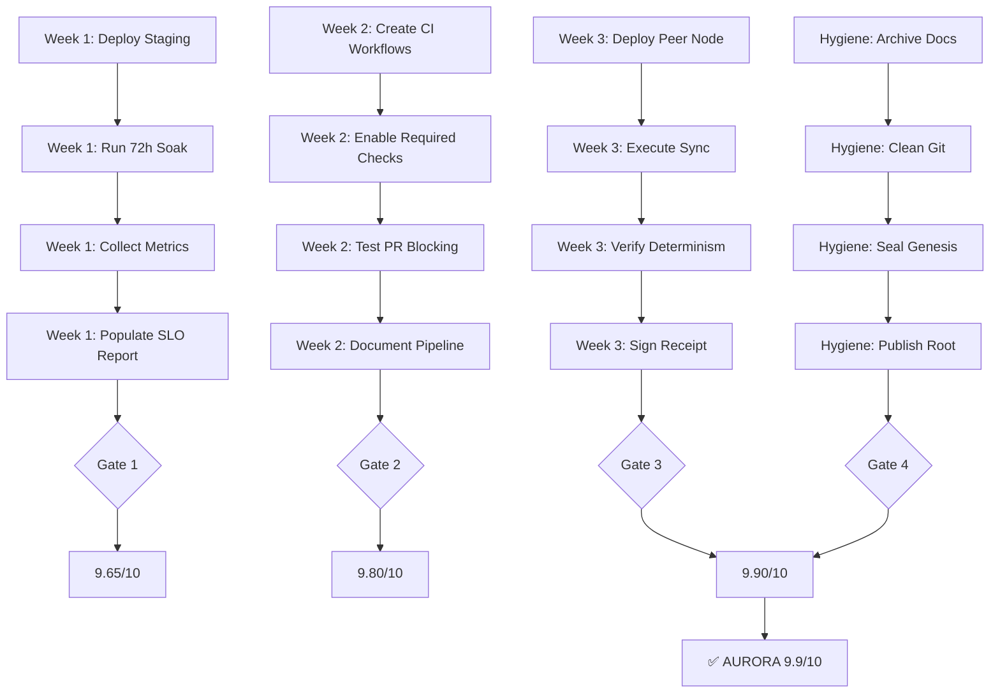

# 🗺️ Aurora 9.9/10 Visual Roadmap

```
Current State: 9.5/10
     │
     │ Week 1: Operational Excellence (+0.15)
     ├─────────────────────────────────────────┐
     │  Deploy Staging                          │
     │  ├─ K8s overlay applied                  │
     │  ├─ Prometheus configured                │
     │  ├─ 72h soak test running                │
     │  └─ Metrics flowing ✅                    │
     │                                          │
     │  Deliverables:                           │
     │  • canary_slo_report.json (real data)   │
     │  • Grafana screenshot (72h green)        │
     │  • First ledger snapshot                 │
     └─────────────────────────────────────────┘
     │
     v  9.65/10
     │
     │ Week 2: Automation Hardening (+0.15)
     ├─────────────────────────────────────────┐
     │  CI Covenant Enforcement                 │
     │  ├─ Smoke tests block PRs                │
     │  ├─ Covenant validation required         │
     │  ├─ Merkle root auto-publishes           │
     │  └─ Pre-commit hooks enforced ✅          │
     │                                          │
     │  Deliverables:                           │
     │  • .github/workflows/covenant-enforce.yml│
     │  • .git/hooks/pre-commit                 │
     │  • docs/CI_AUTOMATION.md                 │
     └─────────────────────────────────────────┘
     │
     v  9.80/10
     │
     │ Week 3: Federation Proof (+0.10)
     ├─────────────────────────────────────────┐
     │  Peer-to-Peer Sync Working               │
     │  ├─ Node B deployed                      │
     │  ├─ Sync executed (A ↔ B)                │
     │  ├─ Deterministic merge verified         │
     │  └─ Dual-signed receipt ✅                │
     │                                          │
     │  Deliverables:                           │
     │  • Federation receipt (dual-sig)         │
     │  • docs/FEDERATION_GUIDE.md              │
     │  • Smoke test #27 (federation)           │
     └─────────────────────────────────────────┘
     │
     v  9.90/10
     │
     │ Hygiene & Polish (Ongoing)
     ├─────────────────────────────────────────┐
     │  Repository Pristine                     │
     │  ├─ Archive completion markers           │
     │  ├─ Clean git status                     │
     │  ├─ Seal Genesis                         │
     │  └─ Publish Merkle root ✅                │
     └─────────────────────────────────────────┘
     │
     v  9.90/10 ⭐ TARGET ACHIEVED
```

---

## 📊 Progress Heatmap

| Week | Focus Area | Tasks | Impact | Status |
|------|-----------|-------|--------|--------|
| **1** | Operational Excellence | 6 | 🔥🔥🔥🔥🔥 | ⏳ Pending |
| **2** | Automation Hardening | 6 | 🔥🔥🔥🔥 | ⏳ Pending |
| **3** | Federation Proof | 6 | 🔥🔥🔥 | ⏳ Pending |
| **~** | Hygiene & Polish | 9 | 🔥🔥 | ⏳ Pending |

**Legend:**
- 🔥🔥🔥🔥🔥 = Critical path (blocks 9.9)
- 🔥🔥🔥🔥 = High impact (major quality boost)
- 🔥🔥🔥 = Medium impact (nice to have)
- 🔥🔥 = Low impact (polish only)

---

## 🎯 Milestone Gates

### Gate 1: Week 1 Complete ✅
**Criteria:**
- [ ] `canary_slo_report.json` has no nulls
- [ ] All 4 KPIs meet targets
- [ ] 72h uptime proven
- [ ] Grafana screenshot published

**Rating if passed:** 9.65/10

---

### Gate 2: Week 2 Complete ✅
**Criteria:**
- [ ] PRs blocked if smoke tests fail
- [ ] Covenant validation required check
- [ ] Merkle root auto-publishes
- [ ] `docs/CI_AUTOMATION.md` complete

**Rating if passed:** 9.80/10

---

### Gate 3: Week 3 Complete ✅
**Criteria:**
- [ ] Two nodes synced successfully
- [ ] Federation receipt dual-signed
- [ ] `docs/FEDERATION_GUIDE.md` complete
- [ ] Smoke test #27 passing

**Rating if passed:** 9.90/10

---

## 📈 Score Progression

```
9.5  ━━━━━━━━━━━━━━━━━━━━━━━━━━━━━━━━━━━━━━━┓  (Current)
                                            ┃
9.65 ━━━━━━━━━━━━━━━━━━━━━━━━━━━━━━━━━━━━━━┫  Week 1 ✅
                                            ┃
9.80 ━━━━━━━━━━━━━━━━━━━━━━━━━━━━━━━━━━━━━┫  Week 2 ✅
                                            ┃
9.90 ━━━━━━━━━━━━━━━━━━━━━━━━━━━━━━━━━━━━┫  Week 3 ✅ TARGET
     └────┴────┴────┴────┴────┴────┴────┴───
     W0   W1   W2   W3   Hygiene  DONE
```

---

## 🔄 Dependency Flow



<details>
<summary>Text fallback (if Mermaid not rendered)</summary>

**Week 1 Flow:**
1. Deploy Staging
2. Run 72h Soak
3. Collect Metrics
4. Populate SLO Report
5. → Gate 1 → 9.65/10

**Week 2 Flow:**
1. Create CI Workflows
2. Enable Required Checks
3. Test PR Blocking
4. Document Pipeline
5. → Gate 2 → 9.80/10

**Week 3 Flow:**
1. Deploy Peer Node
2. Execute Sync
3. Verify Determinism
4. Sign Receipt
5. → Gate 3 → 9.90/10

**Hygiene Flow:**
1. Archive Docs
2. Clean Git
3. Seal Genesis
4. Publish Root
5. → Gate 4 → 9.90/10

**All Gates → ✅ AURORA 9.9/10**

</details>

---

## 🚦 Traffic Lights (Weekly Status)

### Week 1: Operational Excellence
- **Status:** 🔴 NOT STARTED
- **Blocker:** Staging cluster needs provisioning
- **ETA:** Nov 18, 2025

### Week 2: Automation Hardening
- **Status:** 🔴 NOT STARTED
- **Blocker:** Waiting on Week 1 completion
- **ETA:** Nov 25, 2025

### Week 3: Federation Proof
- **Status:** 🔴 NOT STARTED
- **Blocker:** Waiting on Week 2 completion
- **ETA:** Dec 3, 2025

### Hygiene & Polish
- **Status:** 🟡 CAN START NOW
- **Blocker:** None (independent)
- **ETA:** Ongoing

**Legend:**
- 🟢 IN PROGRESS
- 🟡 READY TO START
- 🔴 BLOCKED / NOT STARTED
- ✅ COMPLETE

---

## 📞 Quick Links

- **Full Proposal:** [AURORA_99_PROPOSAL.md](./AURORA_99_PROPOSAL.md)
- **Task Checklist:** [AURORA_99_TASKS.md](./AURORA_99_TASKS.md)
- **One-Page Summary:** [AURORA_99_SUMMARY.md](./AURORA_99_SUMMARY.md)

---

**Last Updated:** 2025-10-22  
**Target Date:** Dec 3, 2025  
**Confidence:** 85% (high feasibility)
